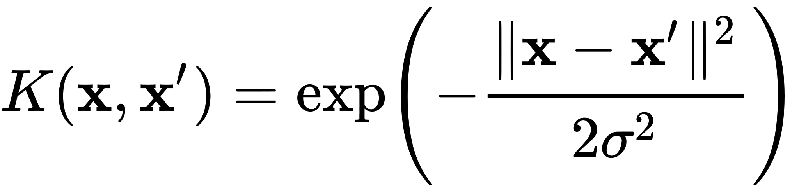

# Machine Learning Challenge
Hands-on Machine Learning

Everyday Machine Learning in Python.

- [x] Linear Regression
- [x] Multiple Regression
- [x] Polynomial Regression
- [x] Support Vector Regression
- [x] Decision Tree Regression
- [x] Random Forest Regression
- [x] Evaluating Regression Models Performance
- [ ] Logistic Regression
- [ ] K-Nearest Neighbor
- [ ] Support Vector Machine
- [ ] Kernel SVM
- [ ] Naive Bayes
- [ ] Artificial Neural Networks
- [ ] Convolutional Neural Network
- [ ] Dimensionality Reduction
- [ ] Principal Component Analysis
- [ ] Linear Discriminant Analysis
- [ ] KERNEL Principal Component Analysis
- [ ] Model Selection
- [ ] XGBoost


## Learnings

### Linear Regression
```python
from sklearn.linear_model import LinearRegression

X = []  
y = []  

model = LinearRegression()
model.fit(X, y)
```

#### Feature Scaling
##### standardization
standardization = x-mean(x)/standard deviation(x)  
 will do it all the time


##### normalization
normalization = (x - min(x))/(max(x)-min(x)) 
for specific tasks with value of **standard distribution**


### Multiple Linear Regression
```python
regressor = LinearRegression()
regressor.fit(X_train, y_train)
LinearRegression(copy_X=True, fit_intercept=True, n_jobs=None, normalize=False)


# prediciting the results
y_pred = regressor.predict(X_test)
np.set_printoptions(precision=2)
print(np.concatenate((y_pred.reshape(len(y_pred),1), y_test.reshape(len(y_test),1)),1))
```

#### Feature Scaling
##### standardization
 standardization = x-mean(x)/standard deviation(x)  
 will do it all the time


#####normalization
normalization = (x - min(x))/(max(x)-min(x)) 
for specific tasks with value of **standard distribution**


### Polynomial Regression
```
y = a0 * x^0 + a1 * x^1 + a2 * x^2 + a3 * x^3 + a4 * x^4 + a5 * x^5 ..
```


### Support Vector Regression

A support vector machine construct a hyper-planes or set of hyper-planes in a high or infinte dimensional space, which can be used for regression, classification etc. 
## Gaussian RBF Kernel



learning: transform the same feature scale in the prediction


### Decision Tree Regression

no feature scaling are resulting from successive splits. no equations!
split data in tree

### Random Forest Regression

More Trees -> More robost, 
Multiple trees 

1. pick at random K data ponts from the traing set
2. build the decision tree associated to these K data points
3. choose the number Ntree of trees you want to build
4. for a new data pints make each one of your ntree trees predict the value of Y to tor the data point in question ; and assigh the new data pont the average acrowss all of the predicted y values.

## R-Squared
average and then minimize the differences to the datapoints

SS res = sum (yi - y^i)^2
         sum (yi - y avg)^2
         
 R^2 = 1- SS res / SS tot
 
 adj R^2 = 1-(1-R^2) n-1/n-p-1
 
 # Categorization
 Unlike regression where you predict a continuous number, you use classification to predict a category. There is a wide variety of classification applications from medicine to marketing. Classification models include linear models like Logistic Regression, SVM, and nonlinear ones like K-NN, Kernel SVM and Random Forests.

